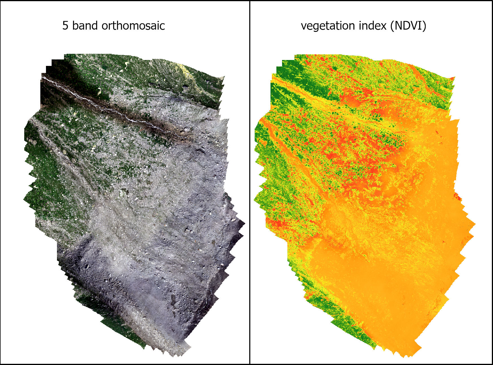
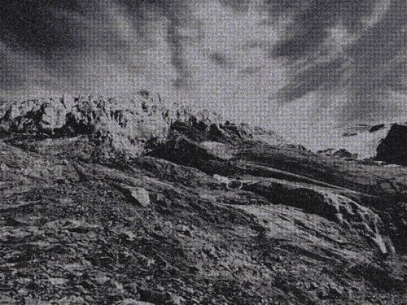
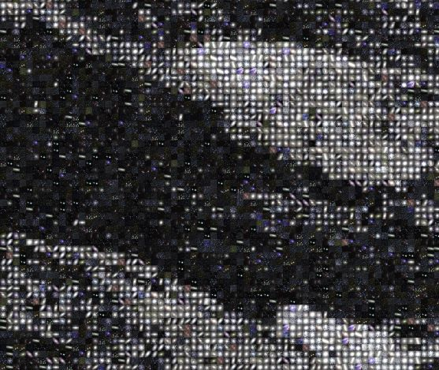
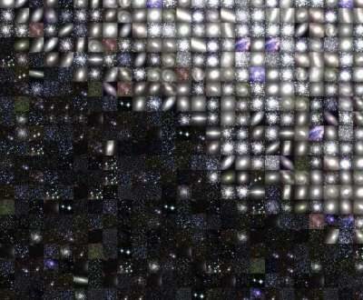

Background idea

My preliminary idea was to create an interactive visual representation of proglacial landscape vegetation using my multispectral drone data.
First, using an orthomosaic of a proglacial landscape I compute vegetation index (NDVI). The NDVI raster is a one band raster that I can export as jpeg.

```{r, fig.cap="*Pelerins field site*", out.width = '80%',echo=FALSE}

```

My objective was to select images for forest, shrub, grass, rock, and water, transform them as tiles, and assign each images to the corresponding ndvi pixel value, to create a mosaic.
For example:
forest image to pixel = 0.7-1
shrub image to pixel = 0.5-0.0.7
grass image to pixel = 0.2-0.5
water image to pixel = (-)1
rock image to pixel = (-)0.9 - 0.2

The results would be an interactive NDVI-vegetation type map. When zooming in we could observe the vegetation type present within the pixel.
However, starting to work on this I noticed it was going to take me a while (weeks?) to figure out a function that can assign an image to each pixel of my NDVI raster. Also I supposed it was going to need a lot of memory to do this.

Therefore I changed my objective, I try to apply the same idea to a picture of my field site in France. 
The Tour glacier.

This is the original picture:

```{r, fig.cap="*Pelerins field site*", out.width = '60%',echo=FALSE}
knitr::include_graphics("image/Tour_original.jpg")
```


Using the RsiMosaic, I applyied the following code to compose a mosaic of the Tour image based on regular tiles representing comets and starts.
First I had to reduce the size of my image to 500x375 pixels (Tour_color).
Then I copied the image inside the package, and ran the code.

I have comented this code, since it is ran from my desktop on the sources images are not on github because there are too heavy.

```{r, include =FALSE}
# library(RsimMosaic)
# 
# # Set the filename of the original image
# origImgFileN <- system.file("extdata", "Tour_color.jpg", package="RsimMosaic") 
# #origImgFileN <- system.file("extdata", "reallyVerySmallMoon.jpg", package="RsimMosaic") 
# 
# # Set the folder where the tiles library is located
# pathToTileLib <- system.file("extdata/2Massier", package="RsimMosaic")
# 
# # Set the filename of the output image (the mosaic!)
# outImgFileN <- file.path("C:/Users/anais/Desktop/ANT388/DataVisualization", "Tour_color_mosaic.jpg")
# 
# # Create the mosaic
# composeMosaicFromImageRandomOptim(origImgFileN, outImgFileN, pathToTileLib, removeTiles=TRUE)
#  
# 
# 
# library(magick)
# Tour_mosaic = image_read("C:/Users/anais/Desktop/ANT388/DataVisualization/image\\Tour_color_mosaic.jpg")
# Tour_mosaic
# 
# 
# print(Tour_mosaic)

```

I uploaded the resulting mosaic to GitHub.
I could not upload the full size image (155MB), so I reduced the size of the image an upload a reduced image (Tour_color_mosaic_reduced)

Here is the full reduced image:

```{r, fig.cap="*Tour image as mosaic*", out.width = '60%',echo=FALSE}

```

And here are some zoom in from the original (full size mosaic image)
As well, I had to reduce the quality of the zooms to be able to upload them on GitHub.


```{r, fig.cap="*Tour image as mosaic _ Zoom 1*", out.width = '60%',echo=FALSE}

```


```{r, fig.cap="*Tour image as mosaic _ Zoom 1*", out.width = '60%',echo=FALSE}

```

Since I could not upload the full mosaic image on GitHub (because the image was too heavy) I cannot use a zoom function to show the detail but had to create small copies of the original mosaic to upload them to GitHub.
